# Social Networks AREQUIPA 360

## Índice

* [1. Preámbulo](#1-preámbulo)
* [2. Resumen del proyecto](#2-resumen-del-proyecto)
* [3. Herramientas](#3-herramientas)
* [4. Historias de usuario](#4-historias-de-usuario)
* [5. Prototipos](#5-prototipos)
* [6. Planificaci[on del proyecto]](#6-planificaci[on del proyecto])
* [7. Resultado](#6-resultado)

***

## 1. Preámbulo

El objetivo del proyecto fue crear una red social con tematica de foro para que los turistas que lleguen a la ciudad de Arequipa puedan dejar sus opiniones y comentarios acerca de la experiencia culinaria, en los lugares y muchos aspectos mas, asi cuando mas personas quieran venir sepan que lugares son los mas recomendados, o cual es el Top 10 de platos tipicos en la ciudad en base a opiniones de personas que ya estuvieron y vivieron la experiencia 360 Arequipa.

## 2. Resumen del proyecto

La tematica elegida fue en apoyo al turismo que ha sido afectado en epoca pándemica.

1.- Los principlaes usuarios del producto son personas interesadas en visitar la ciudad de Arequipa o que estan considerando hacer una ruta por el Perú

2.- Los objetivos de los usuarios en relacion con el producto son saber cuales son los lugares y platos tipicos mejora valorados por los mismos visitantes.

## 3. Herramientas

Los lenguajes utilizados fueron HTML semántico, CSS y JavaScript Vanilla. Se crearon e implementaron test unitarios de funciones puras y se utilizo flexbox y media querys.

## 4. Historias de Usuario

#### Historia de usabilidad 1
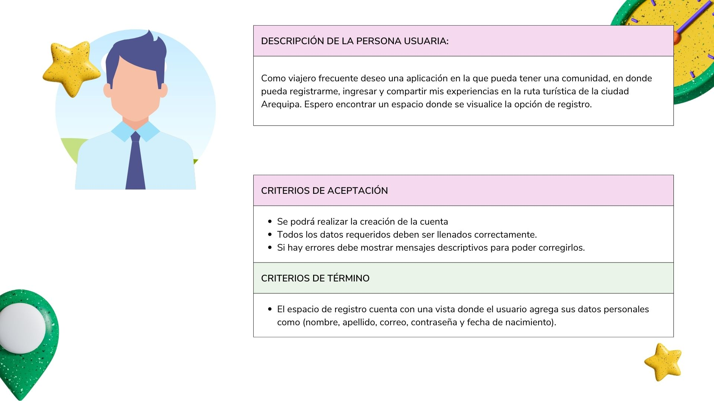
#### Historia de usabilidad 2
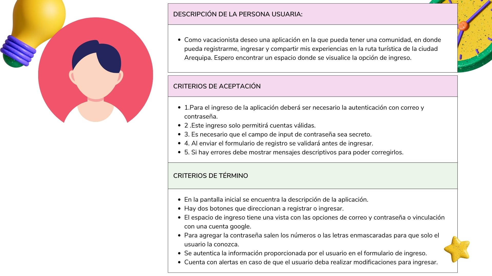
#### Historia de usabilidad 3
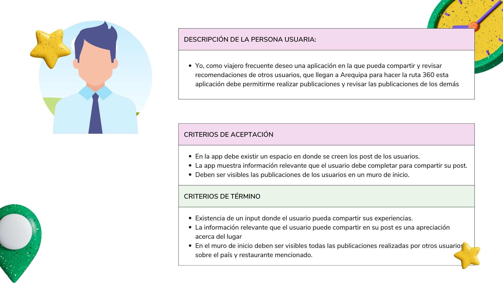
#### Historia de usabilidad 4
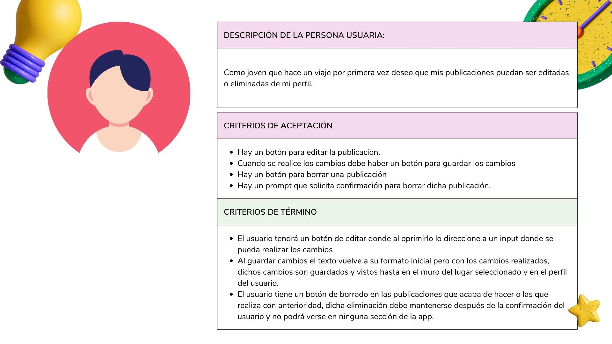
## 5. Prototipos
Se trabajo en la elaboración de un prototipo a papel ,luego uno de alta fidelidad el cual fue evaluado por nuestras compañeras de las cuales recibi feedback para posteriormente y después de aplicar las sugerencias , volver a solicitarles ayuda en el test de usabilidad.

#### Prototipo de baja fidelidad
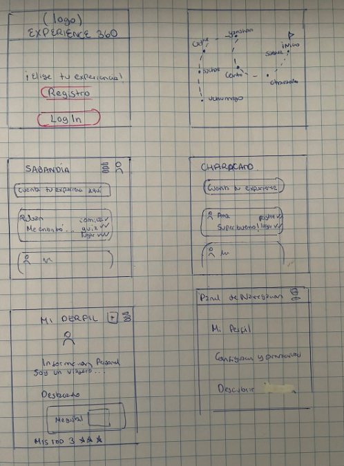

#### Prototipos de alta fidelidad
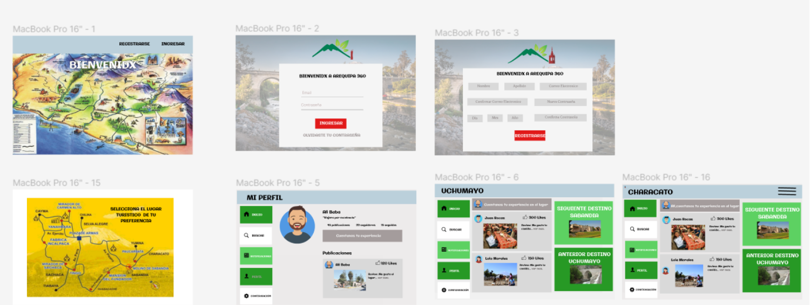

 Prototipo dinámico: [prototipo dinamico](https://www.figma.com/proto/vvNUtz6OP1hfzPwJ7nNjHw/Untitled?type=design&node-id=1-136&t=stdBuyPXIzTgPZDp-1&scaling=scale-down&page-id=0%3A1&starting-point-node-id=1%3A136&show-proto-sidebar=1&mode=design)

#### Listado de problemas de usabilidad detectados 

Hicimos test de usabilidad recibiendo como feedback los siguiente.
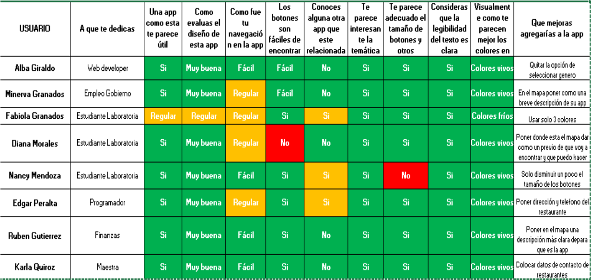
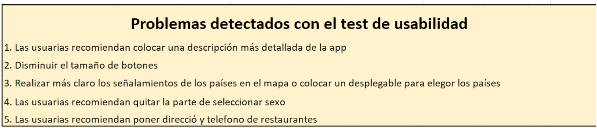
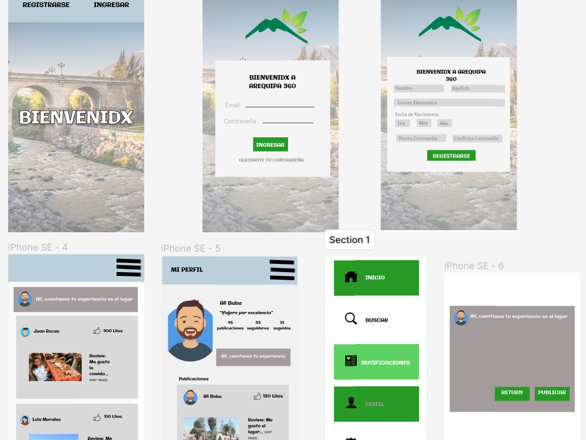

Usamos para el diseño de ambos protipos [Figma](https://www.figma.com/) 
### Pruebas unitarias

El proyecto cuenta con test para las funciones encargadas de  crear, editar, borrar publicaciones. Asi como mantener al usuario logueado, salir sesión.
## 6. Resultado
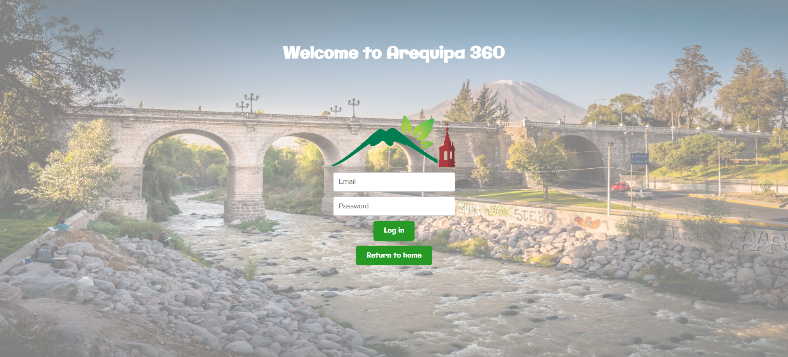
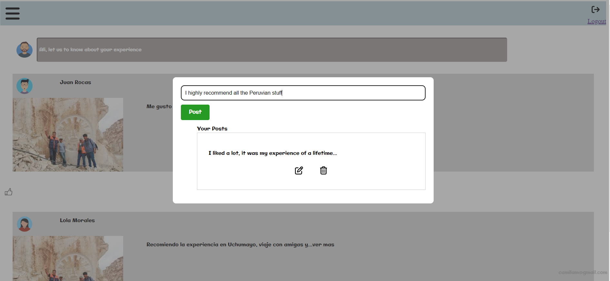